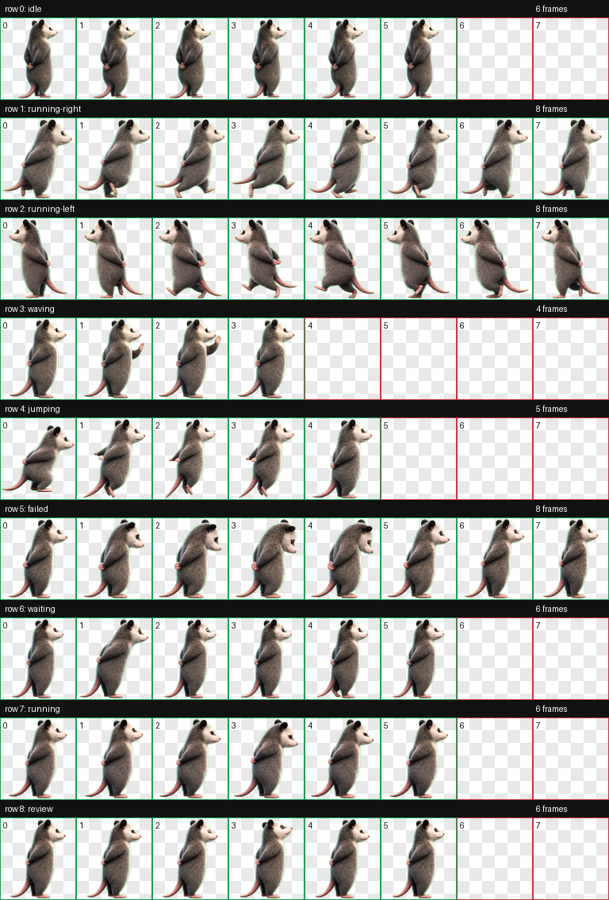
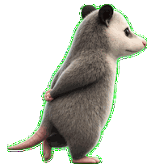
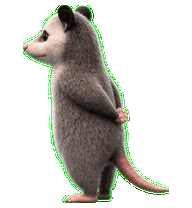
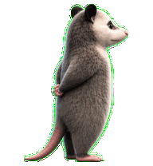
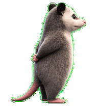
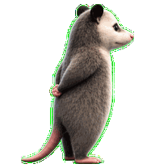
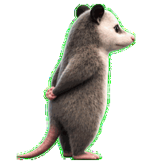

# Window Possum Codex Pet

一只站在窗边、双手背后、正在用沉默审阅你人生进度条的 Codex Pet。

它的工作方式很简单：你写代码，它背手；Codex 跑任务，它背手；测试挂了，它还是背手。稳定得像 CI 里的一个哲学问题。



## 这是什么

`Window Possum` 是一个自定义 [Codex Pet](https://developers.openai.com/codex/app/settings) 包，包含：

```text
window-possum/
├── pet.json
└── spritesheet.webp
```

Codex 会读取 `~/.codex/pets/<pet-id>/` 下面的本地宠物包。这个包已经按 Codex Pet 的固定 atlas 格式制作：

```text
1536 x 1872
8 columns x 9 rows
192 x 208 per cell
transparent background
```

支持的状态包括：

```text
idle
running-right
running-left
waving
jumping
failed
waiting
running
review
```

## 安装

### macOS / Linux

克隆仓库：

```bash
git clone https://github.com/TristanZhang66/window-possum-codex-pet.git
cd window-possum-codex-pet
```

然后运行安装脚本：

```bash
chmod +x install.sh
./install.sh
```

或者手动安装：

```bash
mkdir -p ~/.codex/pets
cp -R window-possum ~/.codex/pets/
```

### Windows (PowerShell)

克隆仓库后，在 PowerShell 中运行：

```powershell
.\install.ps1
```

### 卸载

macOS / Linux：

```bash
./uninstall.sh
```

Windows (PowerShell)：

```powershell
Remove-Item -Recurse -Force "$env:USERPROFILE\.codex\pets\window-possum"
```

### 在 Codex 中启用

1. 进入 `Settings > Appearance > Pets`
2. 点击 `Refresh local pets`
3. 选择 `Window Possum`
4. 开始被它背手凝视

## 预览

| State | Preview |
| --- | --- |
| idle |  |
| running-right |  |
| running-left |  |
| waiting |  |
| running |  |
| review |  |
| failed |  |

## 台词包

仓库里额外带了多语言台词包：

```text
speech/
├── zh-CN.json    # 中文（简体）
├── en.json       # English
├── ja.json       # 日本語
└── ko.json       # 한국어
```

这不是当前官方 Codex Pet manifest 的必需字段。现在 Codex 本地宠物主要读取 `window-possum/pet.json` 和 `window-possum/spritesheet.webp`，所以台词包做成 sidecar 文件，方便未来 Codex/OpenPets 支持自定义气泡，或者你自己做 overlay/fork 时直接接入。

中文台词主打"打工人低功耗自救"和"背手负鼠式精神离职"，比如：

- 我没摸鱼，我在低功耗保命。
- 代码在跑，魂在通勤。
- 卡住了，等你批一下命运。
- 这段代码班味有点重。
- 没炸，是提前下班演习。

使用方式和字段说明见 [docs/speech-pack.md](./docs/speech-pack.md)。

## 梗从哪里来

短版：这是一只「背手负鼠」精神状态外接 Codex。

稍微长一点：中文互联网最近一波负鼠表情包的核心视觉是"背手站立、眼神空洞、姿态认真但荒诞"。新浪的实时收集页把它概括成"背手负鼠"，并提到这类图靠呆滞的背手姿态和生无可恋的视觉冲击形成共鸣。

再往前看，它和这几年中文互联网的"鼠鼠文学""低能量老鼠人"是一条情绪河流里的邻居：

- "鼠鼠文学"把"鼠鼠我啊"变成自嘲第一人称，用可爱外壳承载生活被按在地上摩擦后的碎碎念。
- "低能量老鼠人"把当代年轻人的疲惫、拖延、社交退缩和自我保护，压缩成一种"我先窝一下"的生活姿态。
- "背手负鼠"则更像这套精神宇宙里的中层干部：不解释，不发疯，只背着手看窗外，好像刚刚审批完宇宙的请假流程。
- 近半年仍然很有生命力的"班味""去班味""牛马""脆皮打工人""精神离职""发疯文学"等语境，则负责给这只负鼠补上工位语音包。

这个 Codex Pet 版本把它移植成开发者语境：

- `idle`：我在，但我不想打扰你。
- `waiting`：你要不要批一下权限。
- `running`：我正在努力，虽然看起来只是在背手。
- `review`：这段代码，嗯，有点意思。
- `failed`：没关系，失败也是一种输出。

参考阅读：

- [Codex app settings: Pets](https://developers.openai.com/codex/app/settings)
- [背手负鼠表情包 - 新浪新闻](https://www.sina.cn/news/detail/5299656603211951.html)
- ["鼠鼠文学"，为什么火了？ - 虎嗅](https://m.huxiu.com/article/775552.html)
- [洗澡都要拖到后半夜：我们为何成了低能量的"老鼠人"？ - 虎嗅](https://www.huxiu.com/article/4089751.html)
- ["一旦上过班，气质就变了" "班味"究竟是什么味儿？ - 中新网](https://www.chinanews.com.cn/sh/2024/03-27/10187540.shtml)
- [当校园流行语撞上网络梗 如何疏通"梗阻" - 中新网](https://www.chinanews.com.cn/cul/2025/12-23/10538480.shtml)
- [网络热梗应让公共表达更有温度 - 央广网](https://www.cnr.cn/mspd/sywzl/20260328/t20260328_527565164.shtml)

## 文件说明

`window-possum/pet.json`:

```json
{
  "id": "window-possum",
  "displayName": "Window Possum",
  "description": "A thoughtful 3D animated possum gazing out the window with its hands clasped behind its back.",
  "spritesheetPath": "spritesheet.webp"
}
```

`window-possum/spritesheet.webp` 是实际动画图集。

`preview/` 里是预览图和每个状态的 GIF，方便你在安装前先确认：这只负鼠确实很会背手。

`speech/` 里是多语言台词包（zh-CN、en、ja、ko），不影响 Codex Pet 的标准安装。

`install.sh` / `install.ps1` 是 macOS/Linux 和 Windows 的安装脚本。

`uninstall.sh` 是卸载脚本。

## 二创

欢迎 fork，欢迎二创，欢迎把它改成：

- 你的公司 mascot
- 每天看 Jira 的版本
- 永远等 CI 的版本
- 正在被 TypeScript 凝视的版本

只要还保留那个灵魂姿势：侧身，背手，凝视远方。

## 授权

本仓库中的生成宠物资产以 [CC BY 4.0](./LICENSE) 授权发布。

你可以使用、修改、再分发，但请保留署名。原始网络表情包和参考图不包含在本仓库授权范围内。
